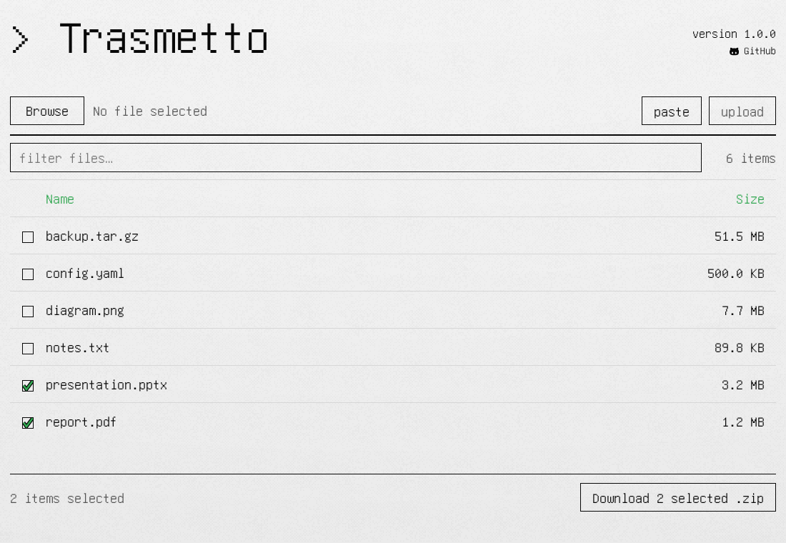

# Trasmetto

Trasmetto is a cross-platform utility to transfer files and directories over
HTTP, which supports both server and client modes. The binaries have no runtime
dependencies and run on Linux, Windows, and macOS.

See [Build](#build) for build instructions. Prebuilt binaries are available on
the [Releases](https://github.com/0xjavlonbeck/trasmetto/releases) page.



Design inspired by [capturetheflag.withgoogle.com](https://capturetheflag.withgoogle.com/).

## Features

- File and directory serving
- Browser UI with a directory listing, live filtering, and sorting by name or size
- Fixed file sets served without directory browsing
- Client mode for downloads and uploads, with no `curl` or `wget` needed
- ZIP downloads of directories or selected files
- Drag-and-drop uploads
- Text pasted or typed in the browser, saved as a file
- Collision-safe uploads; overwriting requires `--allow-replace`
- Authentication support, optionally for uploads only
- Self-signed or user-supplied TLS certificates
- Secret URL prefix, with a generic 404 everywhere else
- Folder creation and deletion from the browser, with `--full-access`
- JSON request log of downloads, uploads and deletions, with `--log`
- Per-download rate limiting

Run `trasmetto --help` for the full option reference.

## Usage

### Server Mode

Serving the current directory on `0.0.0.0:8000`:

```sh
trasmetto
```

Serving a directory on a specified IP and port:

```sh
trasmetto -i 192.168.1.10 -p 8080 -d ./files
```

Serving only specific files, without directory browsing:

```sh
trasmetto -f report.pdf -f notes.txt
```

Running in only-upload and only-download modes:

```sh
trasmetto --only-download
trasmetto --only-upload
```

### Client Mode

Download a file into the current directory, or to a given path with `-o`:

```sh
trasmetto -u http://192.168.1.10:8000/file.txt
trasmetto -u http://192.168.1.10:8000/file.txt -o /tmp/
trasmetto -u http://192.168.1.10:8000/file.txt -o /tmp/file.txt
```

Upload a local file:

```sh
trasmetto -u http://192.168.1.10:8000/ --upload report.pdf
```

Add `--insecure` for a self-signed server.

### HTTPS

Generate a self-signed certificate at startup:

```sh
trasmetto --https
```

Use an existing certificate:

```sh
trasmetto --https --cert fullchain.pem --key privkey.pem
```

### Authentication

Require credentials for everything, or for uploads only:

```sh
trasmetto --auth alice:s3cret
trasmetto --auth-upload alice:s3cret
```

In client mode, use `--auth` to authenticate against the remote server:

```sh
trasmetto -u http://192.168.1.10:8000/file.txt --auth alice:s3cret
```

Pair authentication with `--https`. Otherwise credentials cross the network in
cleartext.

### Hidden Path

Serve under a secret prefix and return a generic 404 anywhere else:

```sh
trasmetto --path secret   # only /secret/... responds
trasmetto --path          # random prefix, printed at startup
```

### Full Access

```sh
trasmetto --full-access
```

Adds a **mkdir** button and a **Delete** button to the browser UI. Deletion asks
for confirmation and never leaves the served directory.

### Logging

```sh
trasmetto --log audit.log   # or bare --log for ./trasmetto-<date>-<time>.log
```

One JSON object per line, appended across restarts. Downloads record what was
taken and how much, uploads record the original and saved names, and deletions
record what was removed.

## Security

- Uploads are enabled by default. Anyone who can reach the server can write
  files into the served directory. Disable them with `--only-download`, or
  require a login with `--auth-upload`.
- `--full-access` lets anyone who can reach the server create folders and delete
  files, including whole directories with their contents. It is off by default,
  and cannot be combined with `--only-download`.

## Build

Requires Go 1.22 or newer.

Build for your current platform only:

```sh
go build ./cmd/trasmetto     # or: make build
```

Build for all platforms:

```sh
make build-all               # all targets, static, CGO_ENABLED=0
```

## License

Released under the GPLv3. See [LICENSE](LICENSE) for details.

Copyright (c) 2026 javlonbeck